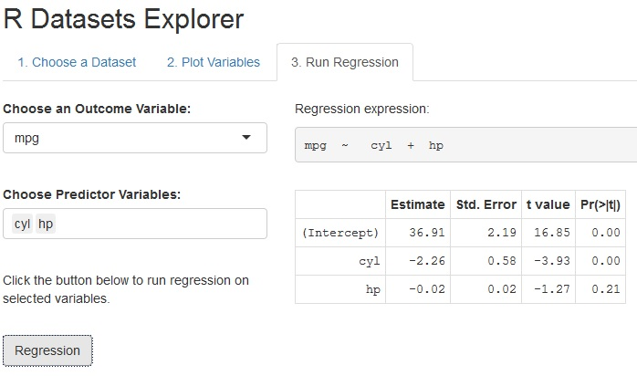
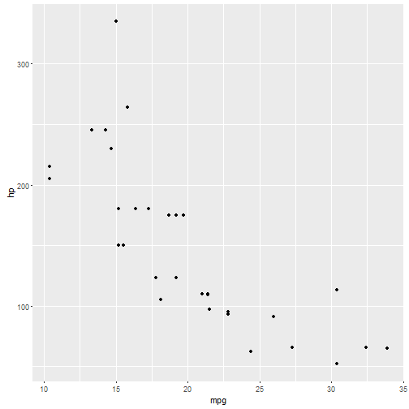

R Datasets Explorer
========================================================
author: Guy Trottier  
date: June 25, 2016

Why R Datasets Explorer?
========================================================

The purpose of the application is to allow a user to quickly preview the many datasets that are
provided in the R 'datasets' package that comes with every R installation.

These datasets are used for demonstration and learning purposes, but it's difficult to know, just by name
which dataset will be a best fit.




Features
========================================================

This application solves this problem by allowing a user to:
  1. View a description of the dataset
  2. Choose two variables with which to make a scatterplot
  3. Run a simple multivariable regression by selecting variables 
      and then viewing the coefficients table


Why you should use it
========================================================

Get a descriprion of the dataset you will be working with preview the variables!
  
  
  ```
                         Title 
  "Motor Trend Car Road Tests" 
  ```
  
  ```
            mpg cyl disp  hp drat   wt  qsec vs am gear carb
  Mazda RX4  21   6  160 110  3.9 2.62 16.46  0  1    4    4
  ```
  See regression results!
  
  
  ```
                Estimate Std. Error   t value     Pr(>|t|)
  (Intercept) 36.9083305 2.19079864 16.846975 1.620660e-16
  cyl         -2.2646936 0.57588924 -3.932516 4.803752e-04
  hp          -0.0191217 0.01500073 -1.274718 2.125285e-01
  ```

At the end of this process, it should be apparent whether or not the chosen dataset will work for you!

Another reason to use it
==========================================================


View the relationships between variables with scatterplots!




The Future of R Datasets Explorer
==========================================================

The __R Datasets Explorer__ is really just the humble beginnings. Below are just a few suggested modifications
that could turn this simple Shiny App into a bonafide _Poor Man's Tableau_:
  1. Allow csv file import so that the user is not limited to exploring just the R datasets.
  2. Allow the selection of multiple plot types.
  3. The ability to apply a suite of machine learning algorithms to the dataset and view the results.
  
